<!-- Banner SVG (hosted in this repo) -->
<div align="center">
  
</div>

<br/>

<!-- Quick bio -->
<table>
<tr>
<td width="55%" valign="top">

### `> whoami`

Analytics Engineer, Data Instructor at **Le Wagon**, and solo founder building AI products. I design and ship data pipelines end-to-end — from raw API to production dashboard.

Previously: pharmacist 🧪 → retail manager 🏪 → data 📊

Currently based in **France**, working globally.

```python
profile = {
    "role":       "Analytics Engineer",
    "teaching":   "Le Wagon (SQL, Python, BigQuery, Power BI)",
    "building":   ["AuditGuard AI", "LIFO.AI"],
    "stack":      ["dbt", "BigQuery", "DuckDB", "Prefect", "FastAPI"],
    "available":  True,  # open to freelance missions
}
```

</td>
<td width="45%" valign="top">

### `> stats`


</td>
</tr>
</table>

---

<!-- Projects -->

## `> ls ./projects`

<table>
<tr>

<td width="50%" valign="top">
<h4>
  
</h4>

End-to-end analytics platform on **French railway punctuality** (SNCF Open Data). Python ingestion with Strategy Pattern, dbt transformation (staging → marts), and a Streamlit dashboard with DuckDB/BigQuery backend switching.

**Stack:**


→ [github.com/slimane-lakehal/ferrodata](https://github.com/slimane-lakehal/ferrodata)

</td>

<td width="50%" valign="top">
<h4>
  
</h4>

Production-grade analytics engineering pipeline on the **Olist e-commerce dataset**. Full Medallion architecture with dbt Core + DuckDB, 25+ tests, automated CI.

**Stack:**


→ [github.com/slimane-lakehal/dbt-analytics-showcase](https://github.com/slimane-lakehal/dbt-analytics-showcase)

</td>

<td width="50%" valign="top">
<h4>
  
</h4>

End-to-end ELT pipeline tracking **GitHub trending repos**. GitHub API → DuckDB → dbt → Evidence.dev dashboard. Orchestrated with Prefect, running on a daily schedule.

**Stack:**


→ [github.com/slimane-lakehal/modern-data-pipeline](https://github.com/slimane-lakehal/modern-data-pipeline)

</td>
</tr>
</table>

---

<!-- Products -->

## `> cat ./products`

<table>
<tr>

<td width="50%" valign="top">

**🛡️ AuditGuard AI** `[building]`

Compliance automation SaaS — scans Google Drive for exposed PII, API keys, and passwords. Generates audit-ready reports for SOC2 / GDPR / HIPAA.

`Next.js` · `FastAPI` · `Supabase` · `Inngest`

</td>

<td width="50%" valign="top">

**🌱 LIFO.AI** `[beta]`

Food waste reduction platform for retail stores. Intelligent scoring engine predicting expiry risk per product, with Square POS integration.

`Python` · `FastAPI` · `Supabase` · `Square API`

</td>
</tr>
</table>

---

<!-- Skills -->

## `> pip list`

<div align="center">

**Analytics & Transform**


**Engineering**


**Web & Viz**


</div>

---

<!-- Languages chart -->

## `> dbt build`

<div align="center">
  
</div>

---

<!-- Contact -->

## `> curl contact`

<div align="center">

[](https://linkedin.com/in/YOUR_PROFILE)
&nbsp;
[](https://slimane-lakehal.github.io/portfolio)
&nbsp;
[](https://www.lewagon.com)

</div>

---

<div align="center">
  
  &nbsp;
  
</div>

<br/>

<div align="center">
  <sub>
    <code>// building in public · france 🇫🇷 · UTC+1</code>
  </sub>
</div>
